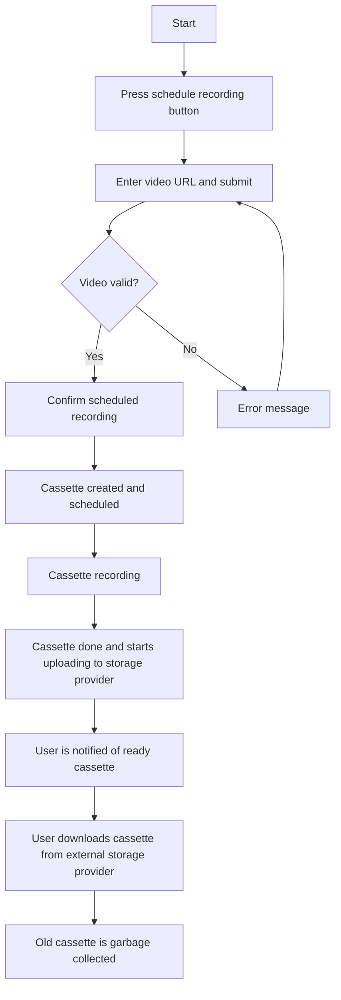
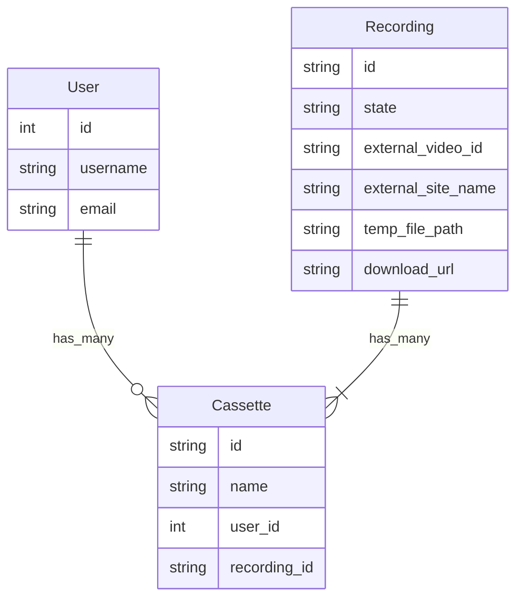
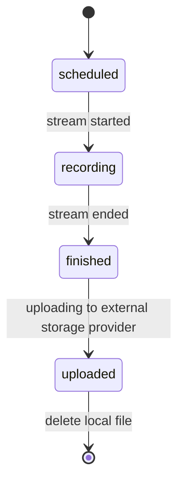

# Introduction

Youtube has 2 main types of content - **Video on Demand (VOD)** and **Livestreams (YT Live)**. **Livestreams** are scheduled, started, and end. They can be privated at any moment by the owner, or deleted by Youtube for whatever reason. While it is possible for most non-technical users to easily download past live streams that are archived, it requires technical knowledge to download ongoing live streams.
Normally, more technical people resort to primitive means such as manually recording the video playback of youtube.com, and then re-upload the file to a file hosting website, or back to Youtube itself.
However, this is quite clunky, doesn't always accurately capture the live stream at the native video and audio qualities, and also requires manual entry of the metadata. It also requires manual work to reupload, and is not possible for niche streams. Individual tools for this like Hoshinova or YTArchive still requires a certain level of technical skill and knowledge of command line tools.

## Purpose

The aim of **YTVCR** is to introduce a hosted, user-friendly self-service system for **recording personal, temporary archives** of Youtube live streams. The way it works is similar to how traditional physical video cassettes and recorders function.

## Features

- Schedule an upcoming Youtube Live Stream for recording
- Save the recording to temporary storage in an external file sharing platform
- Provide access to the recording URL
- Automatically purge `Recordings` older than 3 days
- Maybe initially set a threshold on recording max length

## User flow

1. Open the landing page
2. User logins in using Google Oauth
3. User pastes in their desired Youtube video URL
4. The system fetches the video metadata and checks it's eligibility for an archive
5. The user is presented with a button to `Schedule archive`
6. A virtual `cassette` is created and shown to the user, indicating the future planned recording time
7. When the time comes, the system spawns a `ytarchive` process
8. When the stream is done or the time limit is reached, try to upload the file to storage provider

## Development steps

### Release plan

- Hosting on-premise initially
- Store the recording files on a cheap storage provider like `gofile.io` or `storj.io`
- CloudFlare or Fastly CDN
- Initially only use Holodex API adapter, support only Hololive streams initially

## Data model

A `User` is a user of the system. A `User` can create multiple `Cassette`s.
When a `Cassette` is created, we try to find if a `Recording` with the same `external_url` already exists, since we don't want to create duplicate jobs for the same source video. If it is found, we link it to the `Cassette`, otherwise a new `Recording` is created with the same `external_url`. Then it is the download manager's job to satisfy the `Recording`.
`Recording`s can have different states, starting with `scheduled` and ending with `uploaded`.
Once a `Recording` has been `uploaded`, the local file can and should be deleted to free space for other scheduled temporary fragment files required by `ytarchive`.
Once the expiration time of a `Cassette` has been reached, it is garbage collected by a job, and its associated recording deleted.

`external_video_id` - the unique ID of a source video on the specific video hosting service (e.g. the `video_id` of a Youtube video)
`external_site_name` - the unique name of the source site from which the video is being downloaded from (e.g. `youtube`)
`download_url` - the public URL from which the stored and processed recording can be downloaded by users
`temp_file_path` - the path to the temporary muxed recording file

## Recording state machine

## Design constraints

### ytarchive

YTArchive is quite a flexible tool for easily downloading already started or upcoming Youtube Livestreams. As long as the recording starts while the stream is still running, the archive can be downloaded.

## Design considerations

Q: How to prevent abuse of the system?
A: Enforce user registration using Oauth provider (initially only Google). Set a limit on the number of cassettes a user can have. Raise it manually on request.

Q: How to handle case where there is no more temporary storage left for recording fragments?
A: Have an alert set up, if there is lack of space, delay scheduled recording jobs by X minutes.
